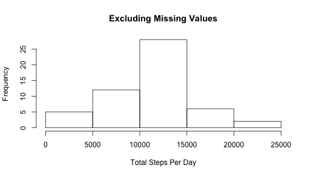
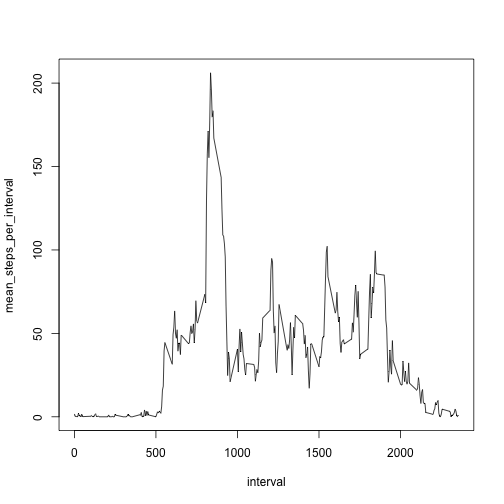
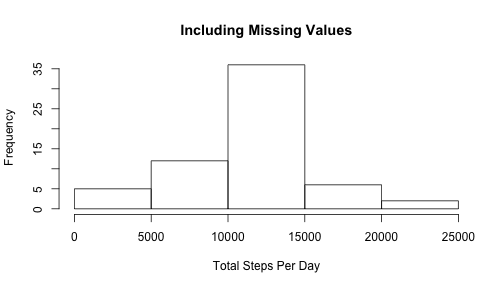
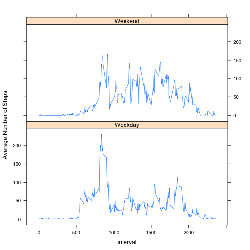

## Loading and preprocessing the data
First of all, I increase the number of digits for the variables that are printed out

```r
options(digits=12)
```

Reading the .csv file

```r
data <- read.csv("activity.csv")
```

## What is mean total number of steps taken per day?
For this part of the assignment, you can ignore the missing values in the dataset.

1. Calculate the total number of steps taken per day

- Create a new data file without missing values

```r
data_noNA <- data[!is.na(data$steps),]
```

- Loading the dplyr library (needed by group_by())

```r
library(dplyr)
```

- Grouping the data without missing values by date and computing the total number of steps taken per day

```r
by_day <- group_by(data_noNA, date)
totalStepsPerDay <- summarize(by_day, total_steps_per_day = sum(steps))
```

2. Make a histogram of the total number of steps taken each day

```r
hist(totalStepsPerDay$total_steps_per_day, xlab ="Total Steps Per Day", main = "Excluding Missing Values")
```

 

3. Calculate and report the mean and median of the total number of steps taken per day

```r
median_noNA <- median(totalStepsPerDay$total_steps_per_day)
mean_noNA <- mean(totalStepsPerDay$total_steps_per_day)
```
- the median and mean are:

```r
median_noNA;mean_noNA
```

```
## [1] 10765
```

```
## [1] 10766.1886792
```
- Just as a cross-check, I also look at the results given by summary(), to make sure I'm not doing something stupid

```r
summary(totalStepsPerDay$total_steps_per_day)
```

```
##       Min.    1st Qu.     Median       Mean    3rd Qu.       Max. 
##    41.0000  8841.0000 10765.0000 10766.1887 13294.0000 21194.0000
```

## What is the average daily activity pattern?

1. Make a time series plot (i.e. type = "l") of the 5-minute interval (x-axis) and the average number of steps taken, averaged across all days (y-axis)

- group the data (without missing values) by interval

```r
by_interval <- group_by(data_noNA, interval)
```

- compute the mean of the steps for each interval

```r
meanStepsPerInterval <- summarize(by_interval, mean_steps_per_interval = mean(steps))
```

- make the plot


```r
with(meanStepsPerInterval, plot(interval, mean_steps_per_interval, type = "l"))
```

 

2.Which 5-minute interval, on average across all the days in the dataset, contains the maximum number of steps?

- I order the data in descending order and print the first line.

```r
head(arrange(meanStepsPerInterval, desc(mean_steps_per_interval)),1)
```

```
## Source: local data frame [1 x 2]
## 
##   interval mean_steps_per_interval
## 1      835           206.169811321
```

## Imputing missing values
Note that there are a number of days/intervals where there are missing values (coded as NA). The presence of missing days may introduce bias into some calculations or summaries of the data.

1.Calculate and report the total number of missing values in the dataset (i.e. the total number of rows with NAs)

```r
sum(is.na(data$steps))
```

```
## [1] 2304
```
2. Devise a strategy for filling in all of the missing values in the dataset. The strategy does not need to be sophisticated. For example, you could use the mean/median for that day, or the mean for that 5-minute interval, etc.

I will use the mean number of steps per 5-minute interval. My idea is to combine data with meanStepsPerInterval, but first I have to create a data frame containing meanStepsPerInterval repeated for the number of days in data.

- create a new data frame containing meanStepsPerInterval repeated for the number of days

```r
meanStepsPerInterval_repeated <- meanStepsPerInterval
for (i in 2:n_distinct(data$date)){
  meanStepsPerInterval_repeated <- rbind(meanStepsPerInterval_repeated,meanStepsPerInterval)  
}
```

- Check that the number of rows in "data" and  "meanStepsPerInterval_repeated" are the same

```r
dim(data);dim(meanStepsPerInterval_repeated)
```

```
## [1] 17568     3
```

```
## [1] 17568     2
```

- Create a new data frame combining data with meanStepsPerInterval_repeated

```r
data_withMeans <- cbind(data, mean_steps_per_interval = meanStepsPerInterval_repeated$mean_steps_per_interval)
```

- Substitute the NA with the corresponding mean_steps_per_interval value

```r
data_withMeans <- within(data_withMeans, steps[is.na(steps)] <- (mean_steps_per_interval[is.na(steps)]))
```
3. Create a new dataset that is equal to the original dataset but with the missing data filled in.

- Get rid of the last column in the new data frame

```r
data_withMeans <- data_withMeans[,1:3]
```
4. Make a histogram of the total number of steps taken each day and Calculate and report the mean and median total number of steps taken per day. Do these values differ from the estimates from the first part of the assignment? What is the impact of imputing missing data on the estimates of the total daily number of steps?

- Group new data by day

```r
by_day_withNA <- group_by(data_withMeans, date)
totalStepsPerDay_withNA <- summarize(by_day_withNA, total_steps_per_day = sum(steps))
```

- Make a histogram of the total number of steps taken each day

```r
hist(totalStepsPerDay_withNA$total_steps_per_day, xlab ="Total Steps Per Day", main = "Including Missing Values")
```

 

- Calculate and report the mean and median of the total number of steps taken per day

```r
median_withNA <- median(totalStepsPerDay_withNA$total_steps_per_day)
mean_withNA <- mean(totalStepsPerDay_withNA$total_steps_per_day)
```

- compute percent difference between median and mean, with and without missing value

```r
100.0*abs(median_withNA-median_noNA)/median_noNA
```

```
## [1] 0.0110420738066
```

```r
100.0*abs(mean_withNA-mean_noNA)/mean_noNA
```

```
## [1] 0
```
So, the mean doesn't change while the median changes by 0.01%

## Are there differences in activity patterns between weekdays and weekends?

For this part the weekdays() function may be of some help here. Use the dataset with the filled-in missing values for this part.

1. Create a new factor variable in the dataset with two levels – “weekday” and “weekend” indicating whether a given date is a weekday or weekend day.

- adding a new column to data_withMeans with the day of the week

```r
data_withMeans <- mutate(data_withMeans, day_of_the_week = weekdays(as.Date(date)))
```

- converting the day of the week in weekend/weekday format

```r
data_withMeans$day_of_the_week <- ifelse(data_withMeans$day_of_the_week %in% c("Saturday","Sunday"), "Weekend", "Weekday")
head(data_withMeans)
```

```
##             steps       date interval day_of_the_week
## 1 1.7169811320755 2012-10-01        0         Weekday
## 2 0.3396226415094 2012-10-01        5         Weekday
## 3 0.1320754716981 2012-10-01       10         Weekday
## 4 0.1509433962264 2012-10-01       15         Weekday
## 5 0.0754716981132 2012-10-01       20         Weekday
## 6 2.0943396226415 2012-10-01       25         Weekday
```

2. Make a panel plot containing a time series plot (i.e. type = "l") of the 5-minute interval (x-axis) and the average number of steps taken, averaged across all weekday days or weekend days (y-axis). See the README file in the GitHub repository to see an example of what this plot should look like using simulated data.

- create data frame for weekday and weekend data

```r
data_weekday <- data_withMeans[data_withMeans$day_of_the_week == "Weekday",]
data_weekend <- data_withMeans[data_withMeans$day_of_the_week == "Weekend",]
```
- group the data by interval

```r
by_interval_weekday <- group_by(data_weekday, interval)
by_interval_weekend <- group_by(data_weekend, interval)
```

- compute the mean of the steps for each interval

```r
meanStepsPerInterval_weekday <- summarize(by_interval_weekday, mean_steps_per_interval = mean(steps))
meanStepsPerInterval_weekend <- summarize(by_interval_weekend, mean_steps_per_interval = mean(steps))
```

- add a column to denote whether it is a weekend or a weekday to then combine the data frames

```r
meanStepsPerInterval_weekday <- mutate(meanStepsPerInterval_weekday, day_of_the_week = "Weekday")
meanStepsPerInterval_weekend <- mutate(meanStepsPerInterval_weekend, day_of_the_week = "Weekend")
meanStepsPerInterval <- bind_rows(meanStepsPerInterval_weekday,meanStepsPerInterval_weekend)
```
- make a plot

```r
library(lattice)
xyplot(mean_steps_per_interval~interval| day_of_the_week, data = meanStepsPerInterval, layout = c(1,2), type = "l", ylab ="Average Number of Steps")
```

 
